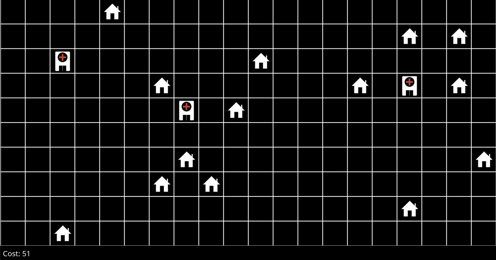

# optimization

## hill climbing

```
λ python hospitals.py
Initial state: cost 69
Found better neighbor: cost 64
Found better neighbor: cost 61
Found better neighbor: cost 57
Found better neighbor: cost 55
Found better neighbor: cost 53
Found better neighbor: cost 52
Found better neighbor: cost 51
Found better neighbor: cost 50
0: Found new best state: cost 62
1: Found new best state: cost 53
2: Found state: cost 60
3: Found state: cost 57
4: Found new best state: cost 46
5: Found state: cost 55
6: Found state: cost 51
7: Found new best state: cost 45
8: Found state: cost 47
9: Found state: cost 51
```



## linear-programming

```
λ python production.py
X1: 1.5 hours
X2: 6.25 hours
```

## scheduling (backtracking search)

```
λ python schedule.py
{'A': 'Monday', 'B': 'Tuesday', 'C': 'Wednesday', 'D': 'Wednesday', 'E': 'Monday', 'F': 'Tuesday', 'G': 'Wednesday'}
```

## crosswords

```
λ python generate.py data/structure1.txt data/words1.txt 1.png
██████████████
███████M████N█
█INTELLIGENCE█
█N█████N████T█
█F██LOGIC███W█
█E█████M████O█
█R███REASON█R█
███████X████K█
██████████████
```